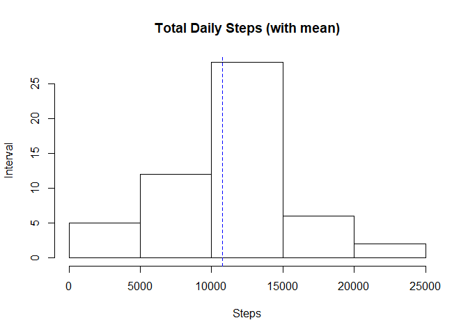
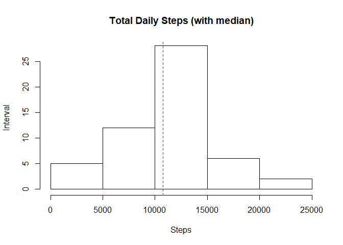
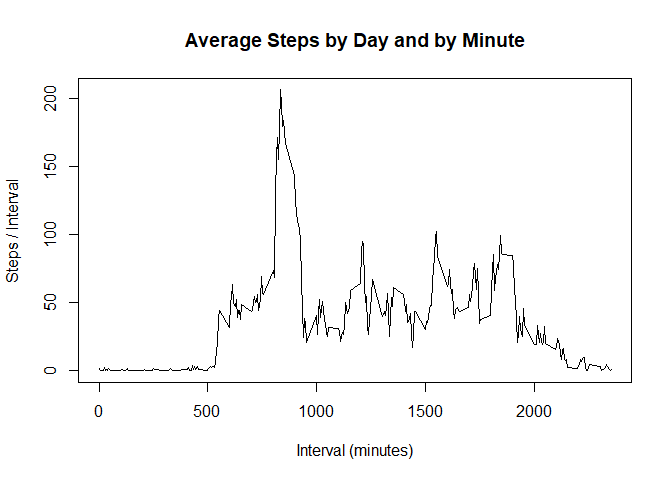
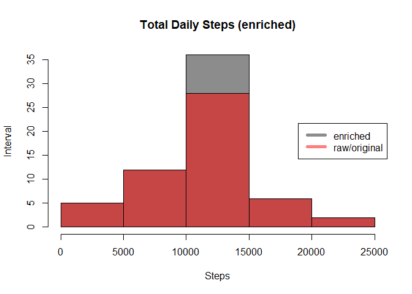
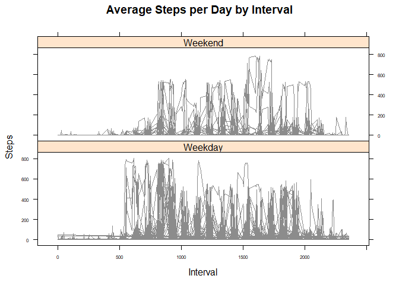

## Loading and preprocessing the data
###### ########################################################################################
###### Step 1 - Loading and preprocessing the data
###### Show any code that is needed to
###### 1. Load the data (i.e. `read.csv()`)
###### 2. Process/transform the data (if necessary) into a format suitable for your analysis
###### assume here that we are loading the activity file from local env and not from a repo
###### ########################################################################################

```r
iot_tracking_activity <- read.csv("activity.csv", sep = ",")
```

###### # NOTE: there are a lot of NAs that need to be removed or filled with default values
###### # NOTE: date is a factor with 61 levels
###### # NOTE: interval starts at 0 and increments by 5 minutes for each observation

```r
names(iot_tracking_activity) # ==> column names
```

```
## [1] "steps"    "date"     "interval"
```

```r
str(iot_tracking_activity) # ==> data
```

```
## 'data.frame':	17568 obs. of  3 variables:
##  $ steps   : int  NA NA NA NA NA NA NA NA NA NA ...
##  $ date    : Factor w/ 61 levels "2012-10-01","2012-10-02",..: 1 1 1 1 1 1 1 1 1 1 ...
##  $ interval: int  0 5 10 15 20 25 30 35 40 45 ...
```

```r
head(iot_tracking_activity[
  which(!is.na(
    iot_tracking_activity$steps)), ])
```

```
##     steps       date interval
## 289     0 2012-10-02        0
## 290     0 2012-10-02        5
## 291     0 2012-10-02       10
## 292     0 2012-10-02       15
## 293     0 2012-10-02       20
## 294     0 2012-10-02       25
```

###### # Sample / head
###### # steps       date interval
###### # 289     0 2012-10-02        0
###### # 290     0 2012-10-02        5
###### # 291     0 2012-10-02       10
###### # 292     0 2012-10-02       15
###### # 293     0 2012-10-02       20
###### # 294     0 2012-10-02       25


## What is mean total number of steps taken per day?
###### ##########################################################################################
###### # Step 2 - What is the mean total number of steps taken per day?
###### # For this part of the assignment, you can ignore the missing values in the dataset.
###### # data wrangling cheat sheet:
###### # https://rstudio.com/wp-content/uploads/2015/02/data-wrangling-cheatsheet.pdf
###### # ########################################################################################

```r
walking_steps_day_2_day <- aggregate(steps ~ date, 
                                     iot_tracking_activity, 
                                     sum)

walking_steps_day_2_day_mean <- mean(walking_steps_day_2_day$steps)
paste0("The total mean number of steps per day is: ", walking_steps_day_2_day_mean)
```

```
## [1] "The total mean number of steps per day is: 10766.1886792453"
```

###### # ########################################################################################
###### # Step 3 - Calculate the total number of steps taken per day
###### # Make a histogram of the total number of steps taken each day
###### # Calculate and report the mean and median of the total number of steps taken per day
###### # ########################################################################################

```r
hist(walking_steps_day_2_day$steps, 
     main = "Total Daily Steps (with mean)", 
     xlab="Steps",
     ylab="Interval")

# NOTE: how to add a vertical line to histograms:
# http://www.sthda.com/english/wiki/abline-r-function-an-easy-way-to-add-straight-lines-to-a-plot-using-r-software#add-a-vertical-line
abline(v = walking_steps_day_2_day_mean, 
       col="blue", 
       lwd=1, 
       lty=2)
```

<!-- -->

```r
# Calculate and report the mean and median of the total number of steps taken per day
walking_steps_day_2_day_median <- median(walking_steps_day_2_day$steps)
paste0("The total mean number of steps per day is: ", walking_steps_day_2_day_mean)
```

```
## [1] "The total mean number of steps per day is: 10766.1886792453"
```

```r
paste0("The total median number of steps per day is: ", walking_steps_day_2_day_median)
```

```
## [1] "The total median number of steps per day is: 10765"
```

```r
# NOTE: the plan was to put both mean and median on the same histogram but they are so close that they layer on
# top of each other and one of the lines will "disapear"
hist(walking_steps_day_2_day$steps, 
     main = "Total Daily Steps (with median)", 
     xlab="Steps",
     ylab="Interval")

abline(v = walking_steps_day_2_day_median, 
       col="red", 
       lwd=1, 
       lty=2)
```

<!-- -->


## What is the average daily activity pattern?
###### # ########################################################################################
###### # Step 4 - What is the average daily activity pattern?
###### # Make a time series plot (i.e. type = "l" of the 5-minute interval (x-axis) and the 
###### # average number of steps taken, averaged across all days (y-axis)
###### # Which 5-minute interval, on average across all the days in the dataset, contains the 
###### # maximum number of steps?
###### # ######################################################################################## 

```r
data_gathered_by_interval <- aggregate(steps ~ interval, 
                                      iot_tracking_activity, 
                                      mean)

plot(data_gathered_by_interval$interval,
     data_gathered_by_interval$steps, 
     type="l", 
     xlab="Interval (minutes)", 
     ylab="Steps / Interval",
     main="Average Steps by Day and by Minute" )
```

<!-- -->

```r
max_data_gathered_by_interval <- data_gathered_by_interval[ which.max(
                                                              data_gathered_by_interval$steps),
                                                            1]
paste0("MaxIum number of steps per interval since data started collecting: ", max_data_gathered_by_interval)
```

```
## [1] "MaxIum number of steps per interval since data started collecting: 835"
```


## Imputing missing values
###### # ########################################################################################
###### # Step 5 - Imputing missing values
###### # Note that there are a number of days/intervals where there are missing values 
###### # (coded as NA). The presence of missing days may introduce bias into some calculations or 
###### # summaries of the data.
###### #
###### # 1) Calculate and report the total number of missing values in the dataset (i.e. the 
###### #    total number of rows with NAs)
###### # 2) Devise a strategy for filling in all of the missing values in the dataset. 
###### #    The strategy does not need to be sophisticated. For example, you could use the 
###### #    mean/median for that day, or the mean for that 5-minute interval, etc.
###### # 3) Create a new dataset that is equal to the original dataset but with the missing data 
###### #    filled in. 
###### # 4) Make a histogram of the total number of steps taken each day and Calculate and report 
###### #    the mean and median total number of steps taken per day. 
###### #    
###### #    - Do these values differ from the estimates from the first part of the assignment? 
###### #    - What is the impact of imputing missing data on the estimates of the total daily 
###### #      number of steps?
###### # ########################################################################################


```r
data_is_na <- sum(!complete.cases(iot_tracking_activity))

paste0("There are ",data_is_na," NA values")
```

```
## [1] "There are 2304 NA values"
```

```r
# NOTE: we need to enrigh the data with "something"
# https://www.rdocumentation.org/packages/base/versions/3.6.2/topics/transform
enriched_data <- transform(iot_tracking_activity, # transform the original dataset
                          steps = ifelse(
                                    is.na(iot_tracking_activity$steps), # if data is NA then...
                                    data_gathered_by_interval$steps[
                                      match(iot_tracking_activity$interval,
                                            data_gathered_by_interval$interval)
                                      ], 
                                    iot_tracking_activity$steps)) # else use the recorded steps for that day/interval

# NOTE: we will use the average for any particular 5 min period withing each day, ie, 
# 24hr * 60 min / interval = 288
enriched_data[as.character(
              enriched_data$date) == "2012-10-01", 1] <- (walking_steps_day_2_day_mean / (24 * 60 / 5))

# we need to overlap the histograms to visualize the differences betweenn enriched data and raw data
# NOTE: https://www.r-bloggers.com/overlapping-histogram-in-r/
hist_color1 = rgb(0.1,0.1,0.1,0.5) # gray
hist_color2 = rgb(1,0,0,0.5) # red

walking_steps_day_2_day_new <- aggregate(steps ~ date, enriched_data, sum)
hist(walking_steps_day_2_day_new$steps, 
     main = "Total Daily Steps (enriched)", 
     col = hist_color1,
     xlab = "Steps",
     ylab = "Interval")

hist(walking_steps_day_2_day$steps, 
     main = "Total Daily Steps (raw/original)", 
     col = hist_color2,
     xlab = "Steps",
     ylab = "Interval",
     add = T) # add a layer

legend("right", 
       c("enriched", "raw/original"), 
       col=c(hist_color1, hist_color2), 
       lwd=5)
```

<!-- -->

```r
enriched_mean <- mean(walking_steps_day_2_day_new$steps)
enriched_median <- median(walking_steps_day_2_day_new$steps)

paste0("The enriched mean is: ", enriched_mean)
```

```
## [1] "The enriched mean is: 10766.1886792453"
```

```r
paste0("The enriched median is: ", enriched_median)
```

```
## [1] "The enriched median is: 10766.1886792453"
```

```r
delta_mean <- enriched_mean - walking_steps_day_2_day_mean
delta_median <- enriched_median - walking_steps_day_2_day_median

real_delta <- sum(walking_steps_day_2_day_new$steps) - 
              sum(walking_steps_day_2_day$steps)

paste0("After enriching the data, the delta between the two analysis is: ", real_delta)
```

```
## [1] "After enriching the data, the delta between the two analysis is: 86129.5094339623"
```


###### ## Are there differences in activity patterns between weekdays and weekends?
###### # ########################################################################################
###### # Step 6 - Are there differences in activity patterns between weekdays and weekends?
###### # For this part the weekdays() function may be of some help here. Use the dataset with the 
###### # filled-in missing values for this part.
###### #
###### # 1) Create a new factor variable in the dataset with two levels – “weekday” and “weekend” 
###### #    indicating whether a given date is a weekday or weekend day.
###### # 2) Make a panel plot containing a time series plot (i.e. type = "l") of the 5-minute 
###### #    interval (x-axis) and the average number of steps taken, averaged across all weekday
###### #    days or weekend days (y-axis).
###### # ########################################################################################

```r
wk <- c("Monday", "Tuesday", "Wednesday", "Thursday", "Friday" )

enriched_data$wkday = as.factor(
                      ifelse(
                        is.element(
                          weekdays(
                            as.Date(
                              enriched_data$date
                              )),wk), 
                        "Weekday", 
                        "Weekend"))

# NOTE: jsut for debudding purposes
# paste0("this is enriched", enriched_data)

walking_steps_enriched_mean <- aggregate(steps ~ interval + wkday, 
                                         enriched_data, 
                                         mean)

# NOTE: jsut for debudding purposes
# paste0(walking_steps_enriched)

library(lattice)

#hist_color1 = rgb(0.1,0.1,0.1,0.5) # gray
#hist_color2 = rgb(1,0,0,0.5) # red
xyplot(enriched_data$steps ~ enriched_data$interval | enriched_data$wkday, 
       main="Average Steps per Day by Interval",
       xlab="Interval", 
       ylab="Steps",
       auto.key=TRUE,
       par.settings = simpleTheme(col=c(hist_color1, hist_color2)),
       scales=list(cex=0.5),
       layout=c(1, 2),
       type="l") 
```

<!-- -->
